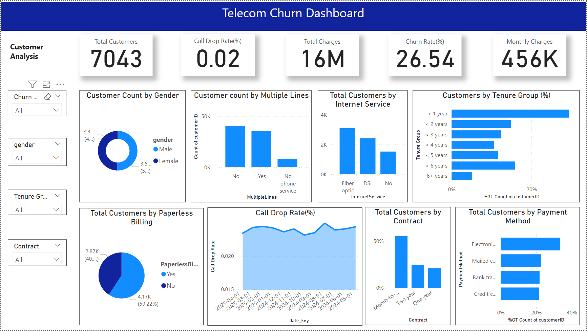

# 📊 Telecom Churn Analytics – SSIS | SSAS (Tabular) | Power BI

This project simulates an end-to-end enterprise Business Intelligence (BI) pipeline for analyzing customer churn in a telecom company. The pipeline spans data extraction from raw files and PostgreSQL, transformation with SSIS, data modeling with T-SQL in SQL Server, advanced analytics with SSAS (Tabular), and visualization with Power BI.

---

## 🚀 Objectives

- Simulate a multi-zone data pipeline: **Landing → Staging → Processed → Semantic**
- Demonstrate enterprise-grade data integration and transformation using **SQL Server Integration Services (SSIS)**
- Design and build **fact and dimension tables in SQL Server** using **T-SQL**
- Perform DAX-based analytics using **SQL Server Analysis Services (SSAS Tabular)**
- Develop interactive dashboards using **Power BI** for churn and customer behavior insights

---

## 🛠️ Tools & Technologies

| Component       | Technology                     |
|----------------|----------------------------------|
| ETL             | SSIS, SQL Server, PostgreSQL    |
| Data Warehouse  | SQL Server (Star Schema)        |
| OLAP Modeling   | SSAS Tabular (DAX Measures)     |
| Reporting       | Power BI                        |
| Scripting       | T-SQL, DAX                      |

---

## 📂 Project Structure

📁 data/
└── raw/
├── bss_churn_data.csv
├── network_usage.csv
└── complaints.csv
📁 ssis/
└── ETL packages (Landing → Staging → Processed)
📁 sql/
└── Table creation & data population scripts (Fact & Dimension)
📁 ssas/
└── Tabular model (DAX measures, calculated columns)
📁 powerbi/
└── .pbix report file
📄 README.md

## 🧩 Data Modeling

- **Schema:** Star Schema
- **Fact Tables:**
  - `fact_bss_churn_data` – customer-level churn and account metrics
  - `fact_network_usage` – usage KPIs like call drops and data usage
  - `fact_complaints` – complaint history with resolution status
- **Dimension Tables:**
  - `dim_customer`
  - `dim_date`
  - `dim_complaint`
  - `dim_network_usage`
  - `dim_towers_data` (for geospatial mapping)

> All tables were created using T-SQL. SSAS Tabular was used to create **calculated columns**, **KPIs**, and **DAX measures** for advanced slicing and aggregation.

---

## 📈 Key Insights in Power BI

- Churn rate by tenure, contract type, and monthly charges
- Correlation between unresolved complaints and churn
- Call drop rate analysis and complaint resolution time
- Drill-down by gender, geography, and service type
- Gauge chart for churn risk indicator

---

## 💡 Simulated Add-ons

- **Churn Flag**: Derived based on simulated business rules
- **Resolution Delay Column**: Synthetic data to model delay-to-churn relationship

> Note: Some datasets are simulated to reflect real-world patterns while preserving data privacy. This is a showcase project, not for commercial use.

---

## 📊 Sample Dashboard

---

## 📌 How to Use

1. Clone this repository
2. Launch SSIS and open the ETL packages under `/ssis`
3. Create the SQL Server schema and tables using scripts in `/sql`
4. Deploy the SSAS Tabular model under `/ssas` for DAX logic
5. Open the Power BI report in `/powerbi/Telecom_Churn_Analytics.pbix` and refresh data

---

## 📬 Contact

For questions or collaborations:
Nasrullah Chandio
nchandio.pk@gmail.com
